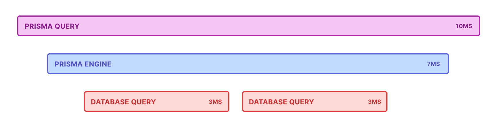

## 概要

Prisma経由で発行されるクエリをチューニングする際のTIPSを順不同でまとめました。  
(記事というよりは自分用のメモです)

## Prismaのクエリログを有効化する

以下の方法などでPrismaのクエリログを有効化する

ref: https://www.prisma.io/docs/orm/reference/prisma-client-reference#log

```ts
// クエリログイベントを有効化
const prisma = new PrismaClient({
  log: [
    {
      emit: 'event',
      level: 'query',
    },
  ],
})

// クエリログイベントを$onでListenした上で、コンソールにログ出力(全件出力する場合)
prisma.$on('query', async (e) => {
  console.log(`${e.duration}ms: ${e.query} ${e.params}`)
})

// クエリログイベントを$onでListenした上で、コンソールにログ出力(指定時間以上かかったものだけ出力する場合)
prisma.$on('query', (e) => {
  if (e.duration > 10) {
    console.log(`${e.duration}ms: ${e.query} ${e.params}`)
  }
})
```

## Joinする(relationLoadStrategyを指定する)

relationLoadStrategyの指定自体は手軽に出来るので、まずはこれで効果が出ないか確かめる手がある

ref: https://www.prisma.io/docs/orm/prisma-client/queries/relation-queries
```ts
const users = await prisma.user.findMany({
  relationLoadStrategy: 'join', // or 'query'
  select: {
    posts: true,
  },
})
```

## Traceを見る

Prismaのトレース機能を利用してクエリの全体像を見るのも効果的

例えばこれで、relationLoadStrategy join を利用しない場合にクエリが分割されていることもわかるし、
`prisma:engine:db_query` ではなくて、`prisma:engine:serialize` に時間がかかる場合があることも分かった。



ref: https://www.prisma.io/docs/orm/prisma-client/observability-and-logging/opentelemetry-tracing


```prisma
generator client {
  provider        = "prisma-client-js"
  previewFeatures = ["tracing"]
}
```

```ts
// Imports
import { SEMRESATTRS_SERVICE_NAME, SEMRESATTRS_SERVICE_VERSION } from '@opentelemetry/semantic-conventions'
import { OTLPTraceExporter } from '@opentelemetry/exporter-trace-otlp-http'
import { registerInstrumentations } from '@opentelemetry/instrumentation'
import { SimpleSpanProcessor } from '@opentelemetry/sdk-trace-base'
import { NodeTracerProvider } from '@opentelemetry/sdk-trace-node'
import { PrismaInstrumentation } from '@prisma/instrumentation'
import { Resource } from '@opentelemetry/resources'

// Configure the trace provider
const provider = new NodeTracerProvider({
  resource: new Resource({
    [SEMRESATTRS_SERVICE_NAME]: 'example application',
    [SEMRESATTRS_SERVICE_VERSION]: '0.0.1',
  }),
})

// Configure how spans are processed and exported. In this case we're sending spans
// as we receive them to an OTLP-compatible collector (e.g. Jaeger).
provider.addSpanProcessor(new SimpleSpanProcessor(new OTLPTraceExporter()))

// Register your auto-instrumentors
registerInstrumentations({
  tracerProvider: provider,
  instrumentations: [new PrismaInstrumentation()],
})

// Register the provider globally
provider.register()
```

## DBログを追加する

PrismaレベルというよりはDBレベルで、例えばPostgreSQLの `auto_explain` などを有効化してログに出力する。

ログに出力されたクエリを単発でExplainで実行しながらIndex調整などを行ってみるのも一手だが、RLSを利用している場合はRLSが適用された状態で見ないと意味がないので注意が必要  
(DBログのAutoExplainを見た方が手っ取り早いこともある)
